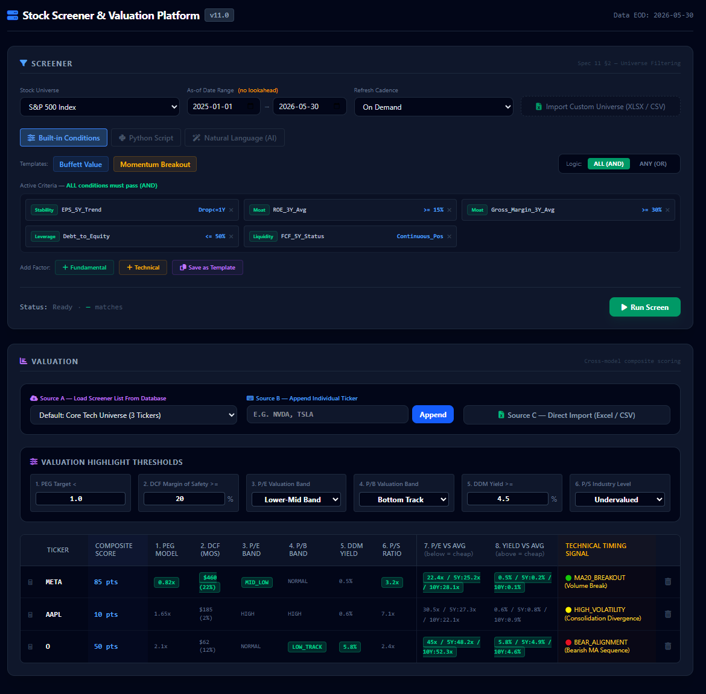

# Stock Screener & Valuation — Sub-Spec Index

> **Start here.** This folder contains all design documents for the Stock Screener (Block A) and Valuation Matrix (Block B) features defined in [`11StockScreenerKLineProduct.md`](../11StockScreenerKLineProduct.md).

---

## Live Frontend Prototype

Open [`ScreenerV2.html`](./ScreenerV2.html) in any browser to see the interactive prototype.
No build step required — it runs entirely in the browser.

---

## What It Looks Like



The UI has two blocks:

| Block | What it does |
|---|---|
| **Block A — Screener** | Filter a stock universe by conditions (built-in / Python / AI). Output: ranked symbol list. |
| **Block B — Valuation** | Score each symbol across 8 valuation models. Output: composite score + highlights. |

---

## Read Order — Start Here

If you are new to this feature, read in this order:

```
1. This README          ← you are here
2. ScreenerUiOverview.md   ← full UI walkthrough with screenshots and ASCII diagrams
3. SpecCDatabase.md        ← data model (read this before A/B/D — they all reference it)
4. SpecAScreenerEngine.md ← Block A logic: C++ classes, AND/OR evaluation, DB queries
5. SpecBValuationEngine.md← Block B logic: 8 model formulas, composite score, C++ headers
6. SpecDNlPythonRuntime.md ← Python sandbox + AI bridge for Mode 2 and Mode 3
```

---

## File Index

### Documentation

| File | What it covers |
|---|---|
| [`README.md`](./README.md) | This file — entry point and navigation guide |
| [`ScreenerUiOverview.md`](./ScreenerUiOverview.md) | Complete UI spec: every control, every table column, data flow diagrams, state machine. **Includes embedded screenshot.** |
| [`SpecAScreenerEngine.md`](./SpecAScreenerEngine.md) | Block A engine: `ConditionBlock` C++ headers, AND/OR evaluation algorithm, `IFundamentalsRepository`, DuckDB SQL patterns, `AppDb` SQLite operations |
| [`SpecBValuationEngine.md`](./SpecBValuationEngine.md) | Block B engine: all 8 model formulas (PEG, DCF, P/E Band, P/B Band, DDM, P/S, P/E vs Avg, Yield vs Avg), composite score (0–120 pts), technical signal logic |
| [`SpecCDatabase.md`](./SpecCDatabase.md) | DB schema: `MarketData.duckdb` (hourlyBars, fundamentals, stocks) + `app.db` SQLite (screenerTemplates, screenerResults, valuationLists, nlAuditLog). Includes 6 data flow diagrams and 7 user workflow SQL examples. |
| [`SpecDNlPythonRuntime.md`](./SpecDNlPythonRuntime.md) | Python `screen()` API contract (all 21 `bars` columns), sandbox rules (forbidden imports, timeouts, memory limits), NL/AI bridge (Claude API), audit write flow |
| [`ApiDataRequirements.md`](./ApiDataRequirements.md) | **What to fetch and compute** — every field in `fundamentals` mapped to its raw API source, computation formula, and minimum historical depth. Reference for the Python pipeline. |

### Frontend

| File | What it is |
|---|---|
| [`ScreenerV2.html`](./ScreenerV2.html) | **Current prototype** — open in browser. Fully interactive (built-in conditions, Python editor with line numbers + lint, NL chat UI, valuation matrix). |
| [`ScreenerV2.html`](./ScreenerV2.html) | Original prototype (archived — superseded by v2) |

### Assets

| File | What it is |
|---|---|
| [`Frontend.png`](./Frontend.png) | Full-page screenshot of `ScreenerV2.html` — used in `ScreenerUiOverview.md` and this README |
| [`FrontendBlockA.png`](./FrontendBlockA.png) | Block A (Screener) highlighted — used in `ScreenerUiOverview.md §BLOCK A` |
| [`FrontendBlockB.png`](./FrontendBlockB.png) | Block B (Valuation Matrix) highlighted — used in `ScreenerUiOverview.md §BLOCK B` |
| [`FrontendPythonScript.png`](./FrontendPythonScript.png) | Python Script mode UI — used in `Spec_D §10 Mode 2` |
| [`FrontendNlAi.png`](./FrontendNlAi.png) | Natural Language (AI) mode UI — used in `Spec_D §10 Mode 3` |

---

## Spec Map — Which Spec Answers Which Question

| Question | Go to |
|---|---|
| What external API fields does the pipeline need to fetch? | [`ApiDataRequirements.md`](./ApiDataRequirements.md) |
| Which fields must be computed vs fetched directly? | [`ApiDataRequirements.md §2`](./ApiDataRequirements.md) |
| How much history does the pipeline need to seed? | [`ApiDataRequirements.md §3`](./ApiDataRequirements.md) |
| What does the UI look like? What does each button do? | [`ScreenerUiOverview.md`](./ScreenerUiOverview.md) |
| What is the JSON format for a condition block? | [`Spec_A §4`](./SpecAScreenerEngine.md) |
| How does AND / OR evaluation work in C++? | [`Spec_A §9`](./SpecAScreenerEngine.md) |
| Which DB tables exist and what are their columns? | [`Spec_C §3–4`](./SpecCDatabase.md) |
| How does the app save a screener template? | [`Spec_C §6 Example 1`](./SpecCDatabase.md), [`Spec_A §10`](./SpecAScreenerEngine.md) |
| How is the PEG / DCF / P/E Band model calculated? | [`Spec_B §7`](./SpecBValuationEngine.md) |
| How is the Composite Score (0–120 pts) calculated? | [`Spec_B §8`](./SpecBValuationEngine.md) |
| What columns does a Python `screen()` script receive? | [`Spec_D §3.2`](./SpecDNlPythonRuntime.md) |
| What imports are forbidden in a Python script? | [`Spec_D §6`](./SpecDNlPythonRuntime.md) |
| How does the NL/AI mode generate and audit code? | [`Spec_D §7–9`](./SpecDNlPythonRuntime.md), [`Spec_C §6 Example 7`](./SpecCDatabase.md) |
| Why are there two databases? Who writes each? | [`Spec_C §2`](./SpecCDatabase.md) |
| Where is the P/E vs Avg / Yield vs Avg logic? | [`Spec_B §7 Models 7–8`](./SpecBValuationEngine.md) |
| How does the Qt UI call the screener engine? | [`Spec_A §12`](./SpecAScreenerEngine.md) |
| How does the Qt UI call the valuation engine? | [`Spec_B §10`](./SpecBValuationEngine.md) |

---

## Key Design Decisions (Quick Reference)

| Decision | Where it's defined |
|---|---|
| DuckDB is **read-only** from C++ | [`04DataLayer.md`](../04DataLayer.md) — project-wide rule |
| App data uses **SQLite** (`app.db`), not DuckDB | [`Spec_C §2`](./SpecCDatabase.md) — C++ must write; DuckDB is Python's |
| Python execution uses **interface** (`ISandboxRunner`) — impl TBD via ADR | [`Spec_D §5`](./SpecDNlPythonRuntime.md) |
| NL-generated code requires **explicit user Accept** before running | [`Spec_D §9`](./SpecDNlPythonRuntime.md), [Spec 11 §3.1](../11StockScreenerKLineProduct.md) |
| Composite Score max is **120 pts** (8 models × 10 + 50 base) | [`Spec_B §8`](./SpecBValuationEngine.md) |
| Technical Signal is **decoupled** from score (display only) | [`Spec_B §7`](./SpecBValuationEngine.md) |
| Yield vs Avg direction is **inverted** vs P/E vs Avg | [`Spec_B §7 Model 8`](./SpecBValuationEngine.md) |

---

## Parent Specs (outside this folder)

| Spec | Why it matters here |
|---|---|
| [`11StockScreenerKLineProduct.md`](../11StockScreenerKLineProduct.md) | Product contract — defines the three modes, AND/OR requirement, result columns (§2.4), NL safety rules (§3.1), audit traceability (§3.2) |
| [`04DataLayer.md`](../04DataLayer.md) | DuckDB read-only rule, `BarStream` API, `DataSource` connection patterns |
| [`03BackendCore.md`](../03BackendCore.md) | Naming conventions, `Result<T>`, `Error`, `Timestamp` — used throughout A/B/D |
| [`02FrontendQt.md`](../02FrontendQt.md) | Threading rules (never block UI thread), widget conventions |
